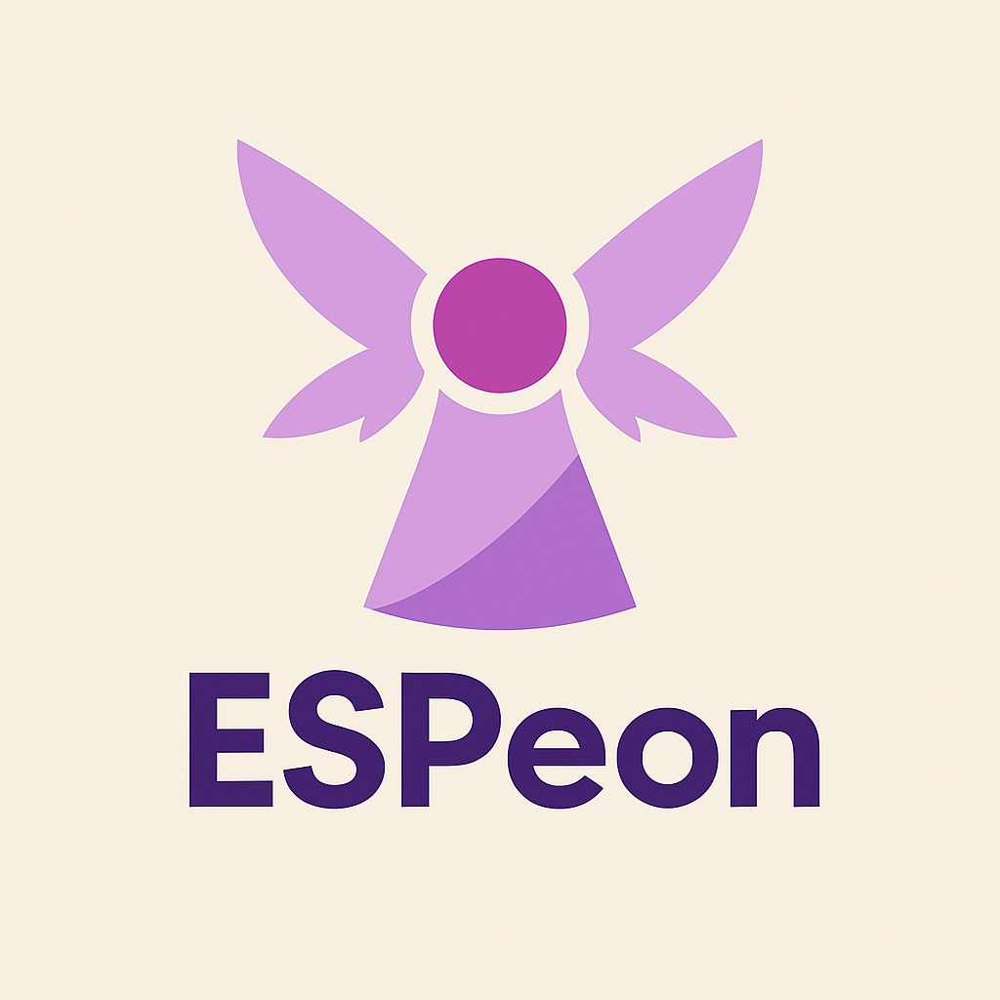

# Espeon: ESP-300 Controller Interface


Our Newport ESP-300 is connected via an RS232 connector and is at least 26 years old. This is antiquated and not portable to modern devices. We want to port it to work with a modern laptop, so this code exists to not require proprietary software to control the translation stage, all while interfacing through USB.

While it may be the case that the RS232-to-USB dongle can be used out of the box, that does not eliminate the fact that needing to read and write byte commands is annoying and not user-friendly. While LabVIEW VIs can be used for this, those are difficult to develop compared to a Python script. Thus, it would be nice to have a more idiosyncratic interface that enables code that looks like
```python
stage = Stage("/dev/whatever", axis=1)
stage.abort()
```
rather than
```python
stage = Stage("/dev/whatever", axis=1)
stage.write(b"AB\r")
```
as the second one would require a lot more sifting through documentation just to read.

While libraries like [pymeasure](https://github.com/pymeasure/pymeasure) exist, they also do not have an idiosyncratic interface that allows a user to write readable code

All of this will make scripting translation stage movement easier for two reasons:
1. LabVIEW VIs are difficult to develop and not as maintainable as Python (or maybe later, C++)
2. There is no need to know what commands to send, as a nice Python API interfaces the writing and reading of bytes

A Python interface can also be chained with C++ SDKs of ThorLabs spectrometers to enable reading of spectroscopic data in the same script, while being more readable than a VI. A C++ interface can do that even more directly. Though, because the SDKs are Windows-only DLLs, that does still require possible interprocess or intermachine communication, which can be achieved through piping or a socket.

ChatGPT 4o helped with figuring out what libraries needed to be used, what commands could be sent, parsing the hundreds of pages of manual, and generating the logo. The manual was then discovered to have extensive documentation for every command, which notably, existing `pymeasure` code does not have individual functions for. Large language models did not contribute to writing any of the code in this folder.
