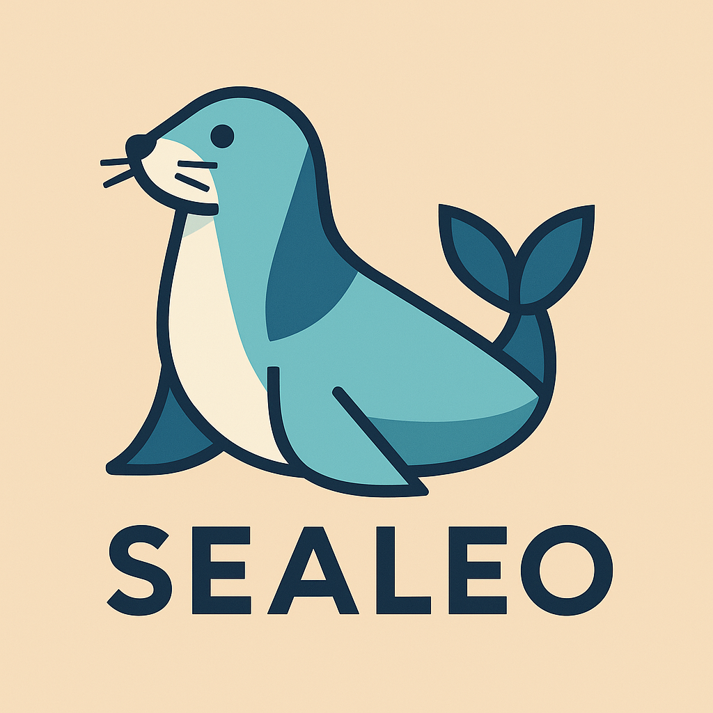

# Sealeo

A clone of Goroutines and Channels in C++ written for entertainment purposes.

## Todo
- [ ] Make a BufferedChannel and UnbufferedChannel class, extend the Channel
- [ ] Logger
- [ ] SharedChannel type declaration
- [ ] Can maybe use concepts or other funny template stuff
